# ASEN 3128 Homework 7

## Question 1:
 

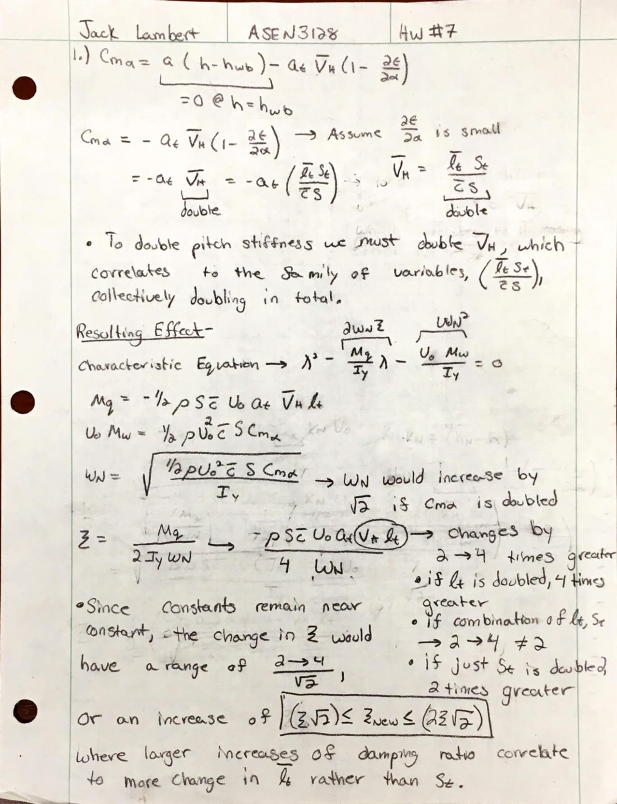

## Question 2:
Using the values for the control derivatives found on page 229 of the Dynamics of Flight book and dimensionalizing them based on the flight conditions provided from case III in Appendix E for a Boeing 747 flying at 40,000 feet, the following B matrix was calculated using the derivations below and implementing them into MATLAB.
 

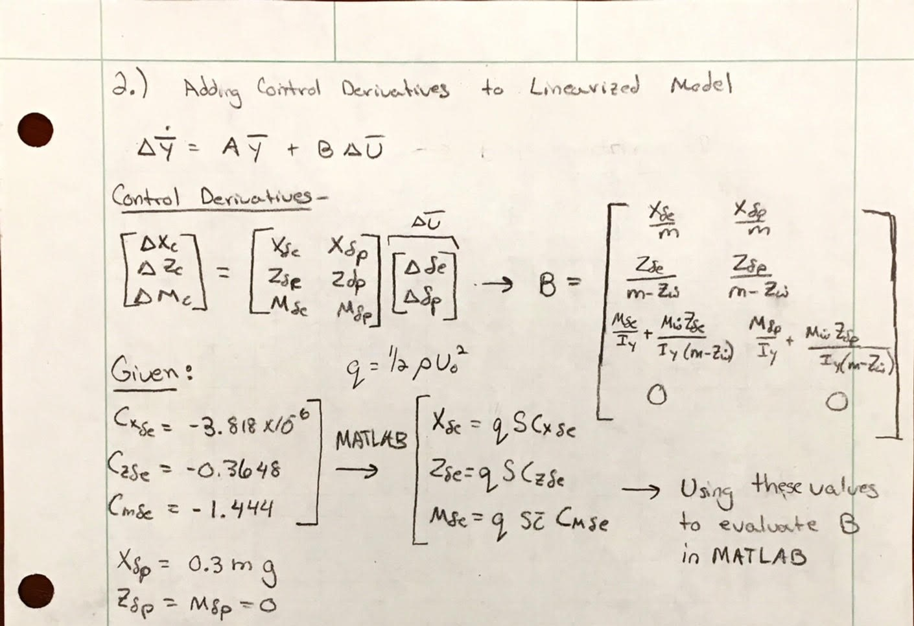
 

$$
B =
\begin{vmatrix}
-7.182 *10^-5 & 2.943  \\
-6.9076 & 0\\
-1.452 & 0 \\
0 & 0 \
\end{vmatrix}
$$
 

## Question 3:
 

### **Part a.)**
To design for increased pitch stiffness in a short period mode, the reduced 2x2 model was used. To model varying pitch stiffness, a scalar multiplier, ks, was varied from 1 to 3, in steps of 0.01. This was done while retaining the original damping ratio. This was done by using the relations between pitch stiffness and the partials from the characteristic equations as displayed below. These relations were found for the uncontrolled case, where alternatively we could have solved for the gains k1 and k2 for the controlled model and implemented those values for the A matrix, however, we leave it as the uncontrolled case to show what will be needed in the A matrix for an increased pitch stiffness of $-C_m\alpha \cdot ks$.
 

**Question 3, Part a, Derivations:**     

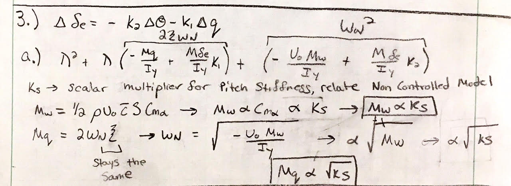
 

Once the relationships between the scalar pitch stiffness multiplier, ks, is found between the corresponding components in the A matrix, the new scaled A matrix can then be used to find the eigenvalues. This was done over each discrete ks value and plotted below. The eigenvalues were found by the relation $|A-\lambda I| = 0$, where the real and imaginary parts of the eigenvalues are plotted on their corresponding axis. It is noticed that the real and imaginary parts increase in magnitude, where the increasing negative real part correlates to larger pitch stiffness as expected.
  

**Question 3, Part a, Eigenvalues Plot:**     

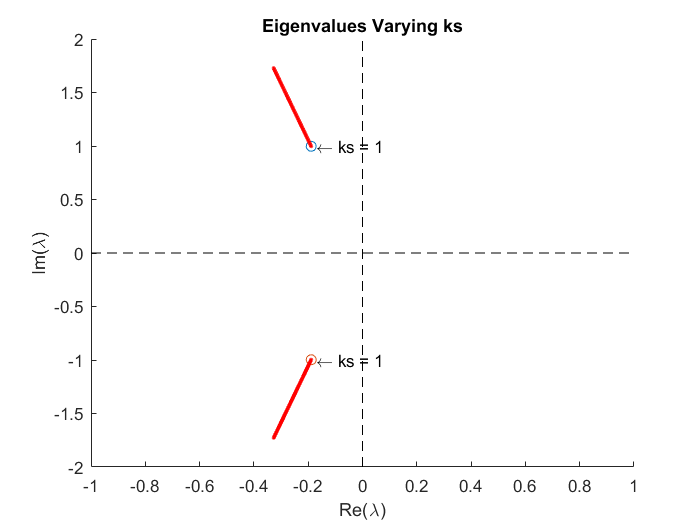
 

### **Part b.)**
Using the relations for the change in the components in the A matrix with changing pitch stiffness, we can derive control constants to give us these changes in pitch stiffness using the control law: $\Delta \delta_e = -k_2 \Delta \theta - k_1\Delta q$. This is done by relating the components of the characteristic equation with the control law implemented to the the components of the characteristic equation we want after changing the pitch stiffness by a scalar ks, as done in part a. The derivations showing this are as such:
 

**Question 3, Part b, Derivations:**     

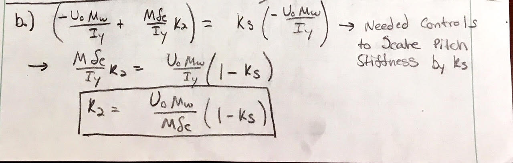
 

**Question 3, Part b, Derivations:**     

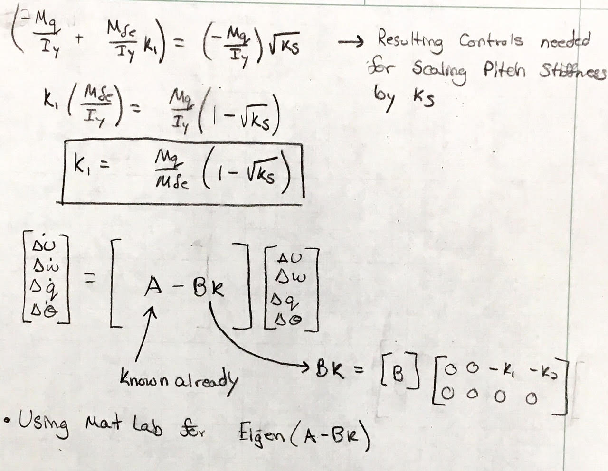
 

Now that we have the gain values k1 and k2 in terms of our knowns, we can use the results from the more simplified reduced 2x2 model for a short period approximation and apply it to the full linearized model. This is done by implementing the B Matrix we solved for in problem 2, so that we have a new closed loop state matrix, A - BK, as shown in the derivations. This Matrix gives us the total picture of the controls need to change the matrix A so that the pitch stiffness of the total system is changing by the scale factor ks. The resulting eigenvalues of this closed loop state matrix are plotted below, where the eigenvalues with smaller real and imaginary parts are for the eigenvalues of the phugoid mode and the larger real and imaginary eigenvalues are for the short period mode. We know this to be true since the more negative real parts have faster time constants.
 

**Question 3, Part b, Eigenvalues Plot:**     

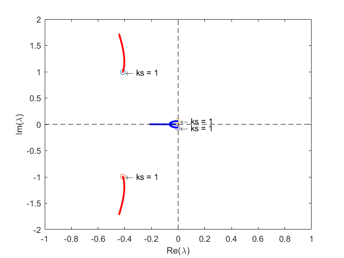
 

The general trend for the eigenvalues show that the short period mode eigenvalues stay near constant for the real parts and increase with ks for the imaginary parts. This is opposition to the trend of the phugoid mode, which is increasing in its eigenvalues real part and decreasing in the eigenvalues imaginary part. This shows that the short period mode is becoming more damped and the phugiod mode is becoming effectively damped. 
 

### **Part c.)**

#### **Simulation with ks = 1 (Unchanged):**
 

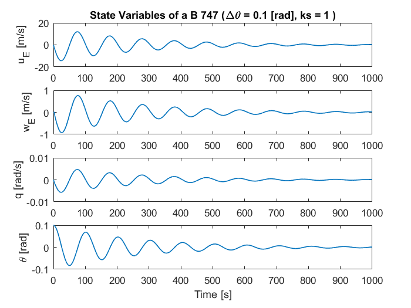
  

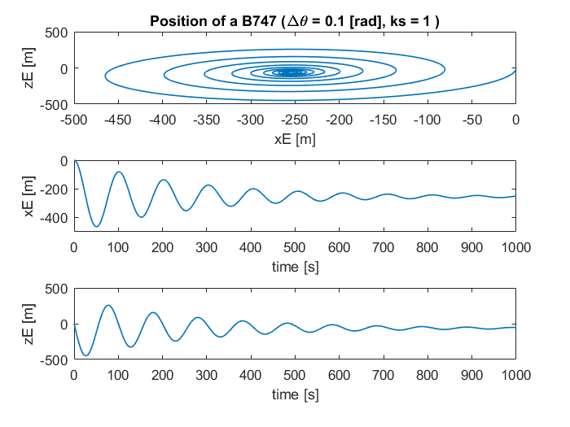
  

#### **Simulation with ks = 2 (Unchanged):**
 

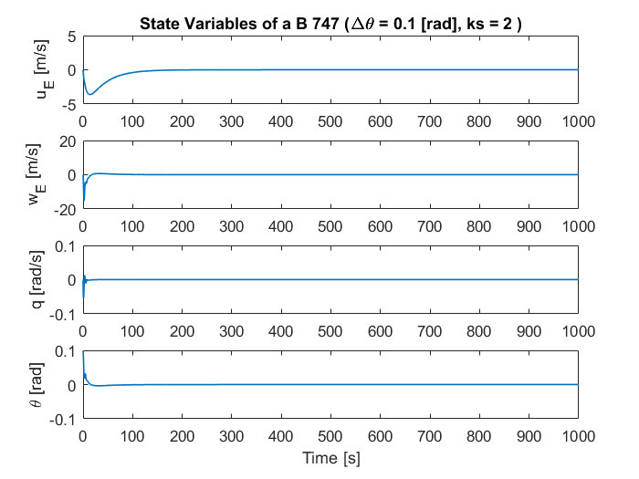
  

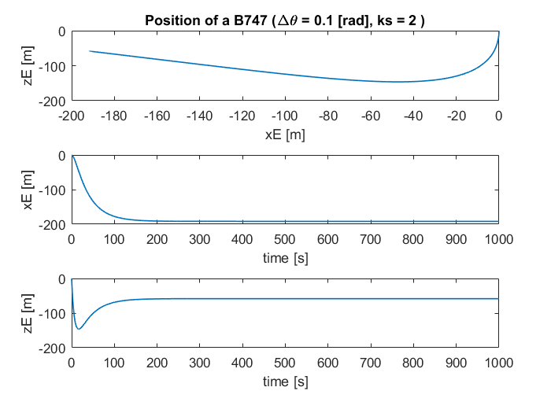
  

As can be seen in the plots above the results from when ks = 1, where the controls for the short period mode are zero, have much different oscillations for the $\Delta \theta $ = 0.1 pertubations, than the case where ks = 2 and the pitch stiffness is doubled. As expected the phugoid mode is driven to have nearly no oscillation in a much shorter time than the uncontrolled case. This implies that the phugoid mode changes when controls are implemented to change the short period mode, which is due to the coupled nature of state variables, where changing the pitch stiffness by a scale factor in the short period mode requires controls that will inherently effect the state variables and cause an induced effect on the phugoid mode. Since we are increasing pitch stiffness, the real parts of the modes increase slightly as the time constant gets reduced. The imaginary parts of the short period mode grow and imaginary parts of the phugoid mode approach zero. This is due to the oscillation of the phugoid mode being damped to zero as the pitch stiffness increases, which intuitively makes sense. The oscillation due to the imaginary parts of the short period mode increase as the controls are excited and the short period is heavily damped.
 

### **Part d.)**:

**Question 3, Part d, Derivations:** 

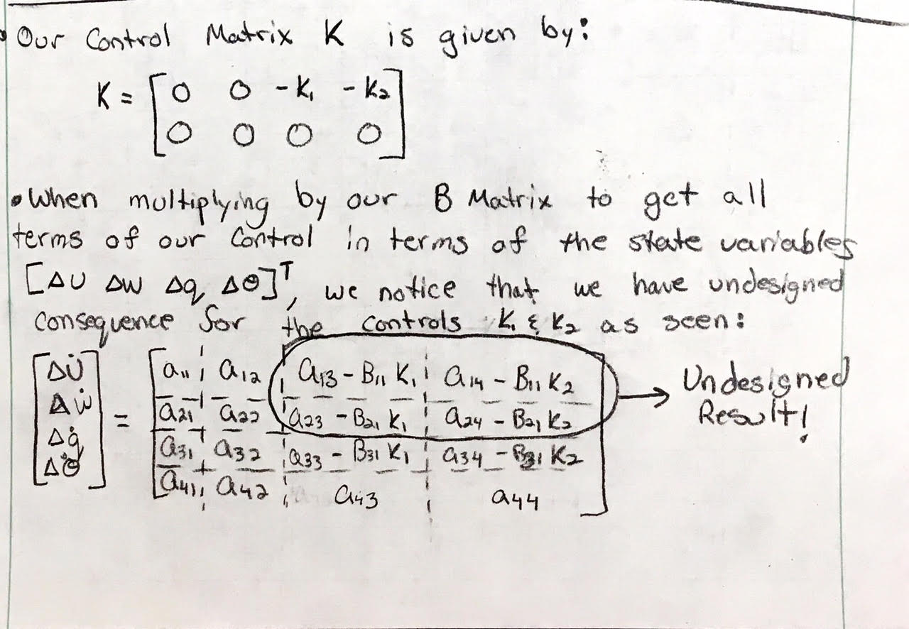
 

When analyzing the coupled effect of controls for the short period mode on the phugoid mode, there were are some key insights to why this happens. First, there is an undesigned effect that results when we implement controls for the short mode as can be seen in the image above. The upper half of the closed loop matrix ends up receiving the controls design for the short period. Second, there is also a natural coupling in the A matrix between the rotational and translational state variables. Since the four variables are coupled, they changed together, which has the inherent effect of changing how the system reacts. In this case the phugoid mode was changed due this natiral coupling between the state variables. This dependence is most likely the dominating contributor to the phugoid mode changing with the controls implemented to change the short period mode since the values from the changing B matrix are seen to small relative to the original A matrix. 